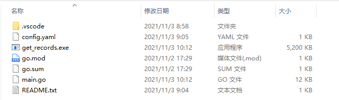
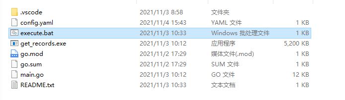
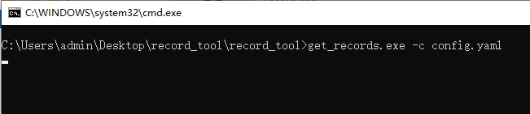
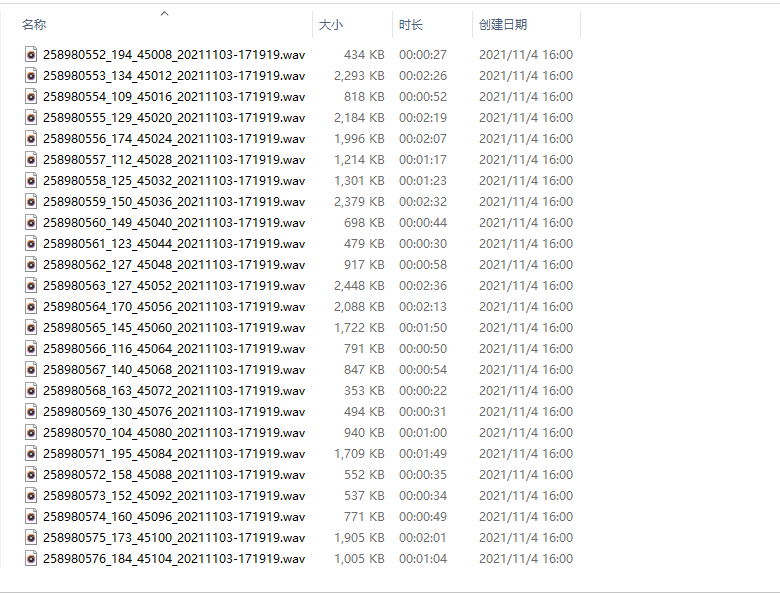

#### 1.将 record_tool.zip 压缩包解压至当前目录，解压之后，进入 record_tool 目录



#### 2.编辑 config.yaml 配置文件，把下面config.yaml配置文件的参数替换成实际使用的参数
#### 变量说明
| 参数名            | 说明                                                         |
| ----------------- | ------------------------------------------------------------ |
| version| PBX 版本，当前示例为：12.6|
| apihost| PBX IP地址，当前示例为：192.168.1.205|
| username| PBX 账号，当前示例为：admin|
| username| PBX 密码，当前示例为：admin|
| start_time| 录音文件开始时间，当前示例为：2021-11-03 17:18:00|
| end_time| 录音文件结束时间，当前示例为：2021-11-04 13:40:00|
| outdir| 录音文件存放目录，当前示例为：C:\Users\admin\Desktop\record|
| outcsvfile| csv文件名称，当前示例为：test.csv|
| outerrcsvfile| 错误csv文件名称，当前示例为：test_err.csv|

**注意把下面相关信息改为自己真实的信息**
```
version: '12.6'
apihost: '192.168.1.205'
username: 'admin'
password: 'admin'
start_time: '2021-11-03%2017:18:00'
end_time: '2021-11-04%2013:40:00'
outdir: 'C:\Users\admin\Desktop\record'
outcsvfile: 'test.csv'
outerrcsvfile: 'test_err.csv'
```

#### 3.修改好 config.yaml 配置文件保存之后，双击运行record_tool目录下的Windows 批处理文件：execute.bat


#### 4.命令正在运行：把租户下所有的录音文件下载到指定的本地目录，并且把录音记录和文件名一起写到CSV文件里。


#### 5.等待命令运行完成之后，查看本地目录，存在下载的录音文件以及CSV文件



